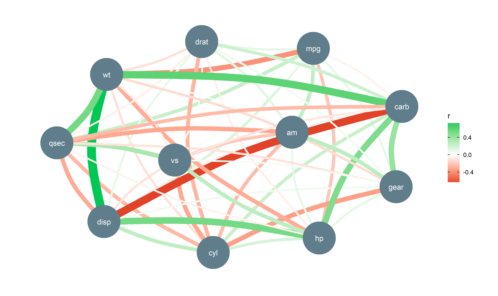

# correlation 

[](https://cran.r-project.org/package=correlation)
[](https://cran.r-project.org/package=correlation)
[](https://travis-ci.org/easystats/correlation)
[](https://codecov.io/gh/easystats/correlation)

`correlation` is a lightweight package helping with correlation
analysis.

## Installation

Run the following:

``` r
install.packages("devtools")
devtools::install_github("easystats/correlation")
```

``` r
library("correlation")
```

## Documentation

[](https://easystats.github.io/correlation/)
[](https://easystats.github.io/blog/posts/)
[](https://easystats.github.io/correlation/reference/index.html)

Click on the buttons above to access the package
[**documentation**](https://easystats.github.io/correlation/) and the
[**easystats blog**](https://easystats.github.io/blog/posts/), and
check-out these vignettes:

  - **No vignettes yet :(**

# Examples

The main function is `correlation()`, which builds on top of
`cor_test()` and comes with a number of possible options.

## Correlation details and matrix

``` r
cor <- correlation(iris)
cor
## Parameter1   |   Parameter2 |     r |     t |  df |      p |         95% CI |  Method | n_Obs
## ---------------------------------------------------------------------------------------------
## Sepal.Length |  Sepal.Width | -0.12 | -1.44 | 148 | 0.152  | [-0.27,  0.04] | Pearson |   150
## Sepal.Length | Petal.Length |  0.87 | 21.65 | 148 | < .001 | [ 0.83,  0.91] | Pearson |   150
## Sepal.Length |  Petal.Width |  0.82 | 17.30 | 148 | < .001 | [ 0.76,  0.86] | Pearson |   150
## Sepal.Width  | Petal.Length | -0.43 | -5.77 | 148 | < .001 | [-0.55, -0.29] | Pearson |   150
## Sepal.Width  |  Petal.Width | -0.37 | -4.79 | 148 | < .001 | [-0.50, -0.22] | Pearson |   150
## Petal.Length |  Petal.Width |  0.96 | 43.39 | 148 | < .001 | [ 0.95,  0.97] | Pearson |   150
```

The output is not a square matrix, but a **(tidy) dataframe with all
correlations tests per row**. One can also obtain a **matrix** using:

``` r
summary(cor)
## Parameter    | Petal.Width | Petal.Length | Sepal.Width
## -------------------------------------------------------
## Sepal.Length |     0.82*** |      0.87*** |       -0.12
## Sepal.Width  |    -0.37*** |     -0.43*** |            
## Petal.Length |     0.96*** |              |
```

Note that one can also obtain the full, **square** and redundant matrix
using:

``` r
as.table(cor)
## Parameter    | Sepal.Length | Sepal.Width | Petal.Length | Petal.Width
## ----------------------------------------------------------------------
## Sepal.Length |      1.00*** |       -0.12 |      0.87*** |     0.82***
## Sepal.Width  |        -0.12 |     1.00*** |     -0.43*** |    -0.37***
## Petal.Length |      0.87*** |    -0.43*** |      1.00*** |     0.96***
## Petal.Width  |      0.82*** |    -0.37*** |      0.96*** |     1.00***
```

``` r
library(dplyr)
library(ggcorrplot)

cor %>% 
  as.matrix() %>% 
  ggcorrplot()
```

<!-- -->

## Grouped dataframes

The function also supports **stratified correlations**, all within the
*tidyverse* workflow\!

``` r
iris %>% 
  select(Species, starts_with("Sepal"), Petal.Width) %>% 
  group_by(Species) %>% 
  correlation()
## Group      |   Parameter1 |  Parameter2 |    r |    t | df |      p |        95% CI |  Method | n_Obs
## -----------------------------------------------------------------------------------------------------
## setosa     | Sepal.Length | Sepal.Width | 0.74 | 7.68 | 48 | < .001 | [ 0.59, 0.85] | Pearson |    50
## setosa     | Sepal.Length | Petal.Width | 0.28 | 2.01 | 48 | 0.101  | [ 0.00, 0.52] | Pearson |    50
## setosa     |  Sepal.Width | Petal.Width | 0.23 | 1.66 | 48 | 0.104  | [-0.05, 0.48] | Pearson |    50
## versicolor | Sepal.Length | Sepal.Width | 0.53 | 4.28 | 48 | < .001 | [ 0.29, 0.70] | Pearson |    50
## versicolor | Sepal.Length | Petal.Width | 0.55 | 4.52 | 48 | < .001 | [ 0.32, 0.72] | Pearson |    50
## versicolor |  Sepal.Width | Petal.Width | 0.66 | 6.15 | 48 | < .001 | [ 0.47, 0.80] | Pearson |    50
## virginica  | Sepal.Length | Sepal.Width | 0.46 | 3.56 | 48 | 0.002  | [ 0.20, 0.65] | Pearson |    50
## virginica  | Sepal.Length | Petal.Width | 0.28 | 2.03 | 48 | 0.048  | [ 0.00, 0.52] | Pearson |    50
## virginica  |  Sepal.Width | Petal.Width | 0.54 | 4.42 | 48 | < .001 | [ 0.31, 0.71] | Pearson |    50
```

## Bayesian Correlations

It is very easy to switch to a **Bayesian framework**.

``` r
correlation(iris, bayesian=TRUE)
## Parameter1   |   Parameter2 |   rho |         89% CI |     pd | % in ROPE |    BF |              Prior | n_Obs
## --------------------------------------------------------------------------------------------------------------
## Sepal.Length |  Sepal.Width | -0.11 | [-0.24,  0.01] | 92.65% |    42.85% |  0.51 | Cauchy (0 +- 0.33) |   150
## Sepal.Length | Petal.Length |  0.86 | [ 0.82,  0.89] |   100% |        0% | > 999 | Cauchy (0 +- 0.33) |   150
## Sepal.Length |  Petal.Width |  0.81 | [ 0.76,  0.85] |   100% |        0% | > 999 | Cauchy (0 +- 0.33) |   150
## Sepal.Width  | Petal.Length | -0.41 | [-0.52, -0.31] |   100% |        0% | > 999 | Cauchy (0 +- 0.33) |   150
## Sepal.Width  |  Petal.Width | -0.35 | [-0.47, -0.24] |   100% |        0% | > 999 | Cauchy (0 +- 0.33) |   150
## Petal.Length |  Petal.Width |  0.96 | [ 0.95,  0.97] |   100% |        0% | > 999 | Cauchy (0 +- 0.33) |   150
```

## Tetrachoric, Polychoric, Biserial, Biweight…

The `correlation` package also supports different types of methods,
which can deal with correlations **between factors**\!

``` r
correlation(iris, include_factors = TRUE, method = "auto")
## Parameter1         |         Parameter2 |     r |      t |  df |      p |         95% CI |      Method | n_Obs
## --------------------------------------------------------------------------------------------------------------
## Sepal.Length       |        Sepal.Width | -0.12 |  -1.44 | 148 | 0.304  | [-0.27,  0.04] |     Pearson |   150
## Sepal.Length       |       Petal.Length |  0.87 |  21.65 | 148 | < .001 | [ 0.83,  0.91] |     Pearson |   150
## Sepal.Length       |        Petal.Width |  0.82 |  17.30 | 148 | < .001 | [ 0.76,  0.86] |     Pearson |   150
## Sepal.Length       |     Species.setosa | -0.93 | -29.97 | 148 | < .001 | [-0.95, -0.90] |    Biserial |   150
## Sepal.Length       | Species.versicolor |  0.10 |   1.25 | 148 | 0.304  | [-0.06,  0.26] |    Biserial |   150
## Sepal.Length       |  Species.virginica |  0.82 |  17.66 | 148 | < .001 | [ 0.77,  0.87] |    Biserial |   150
## Sepal.Width        |       Petal.Length | -0.43 |  -5.77 | 148 | < .001 | [-0.55, -0.29] |     Pearson |   150
## Sepal.Width        |        Petal.Width | -0.37 |  -4.79 | 148 | < .001 | [-0.50, -0.22] |     Pearson |   150
## Sepal.Width        |     Species.setosa |  0.78 |  15.09 | 148 | < .001 | [ 0.71,  0.84] |    Biserial |   150
## Sepal.Width        | Species.versicolor | -0.60 |  -9.20 | 148 | < .001 | [-0.70, -0.49] |    Biserial |   150
## Sepal.Width        |  Species.virginica | -0.18 |  -2.16 | 148 | 0.130  | [-0.33, -0.02] |    Biserial |   150
## Petal.Length       |        Petal.Width |  0.96 |  43.39 | 148 | < .001 | [ 0.95,  0.97] |     Pearson |   150
## Petal.Length       |     Species.setosa | -1.00 |   -Inf | 148 | < .001 | [-1.00, -1.00] |    Biserial |   150
## Petal.Length       | Species.versicolor |  0.26 |   3.27 | 148 | 0.007  | [ 0.10,  0.40] |    Biserial |   150
## Petal.Length       |  Species.virginica |  0.93 |  31.09 | 148 | < .001 | [ 0.91,  0.95] |    Biserial |   150
## Petal.Width        |     Species.setosa | -1.00 |   -Inf | 148 | < .001 | [-1.00, -1.00] |    Biserial |   150
## Petal.Width        | Species.versicolor |  0.15 |   1.87 | 148 | 0.191  | [-0.01,  0.31] |    Biserial |   150
## Petal.Width        |  Species.virginica |  0.99 | 112.56 | 148 | < .001 | [ 0.99,  1.00] |    Biserial |   150
## Species.setosa     | Species.versicolor | -0.88 | -22.35 | 148 | < .001 | [-0.91, -0.84] | Tetrachoric |   150
## Species.setosa     |  Species.virginica | -0.88 | -22.35 | 148 | < .001 | [-0.91, -0.84] | Tetrachoric |   150
## Species.versicolor |  Species.virginica | -0.88 | -22.35 | 148 | < .001 | [-0.91, -0.84] | Tetrachoric |   150
```

## Gaussian Graphical Models (GGMs)

**Gaussian graphical models** are an increasingly popular technique in
psychology, which relationships can be interpreted as partial
correlation coefficients.

``` r
library(ggraph)
library(tidygraph)

mtcars %>% 
  correlation(partial = TRUE) %>% 
  as_tbl_graph() %>% 
  ggraph(layout = 'kk') +
  geom_edge_arc(aes(colour=r, edge_width = abs(r)), strength=0.1) +
  geom_node_point(color="#607D8B", size=22) +
  geom_node_text(aes(label = name), colour="white") +
  scale_edge_color_gradient2(low = "#d50000", high = "#00C853") +
  theme_graph() +   
  guides(edge_width = FALSE) +
  scale_x_continuous(expand = expand_scale(c(.10, .10))) +
  scale_y_continuous(expand = expand_scale(c(.10, .10)))
```

<!-- -->

## Partial Correlations

It also supports **partial correlations** (as well as Bayesian partial
correlations).

``` r
iris %>% 
  correlation(partial = TRUE) %>% 
  summary()
## Parameter    | Petal.Width | Petal.Length | Sepal.Width
## -------------------------------------------------------
## Sepal.Length |    -0.34*** |      0.72*** |     0.63***
## Sepal.Width  |     0.35*** |     -0.62*** |            
## Petal.Length |     0.87*** |              |
```

## Multilevel Correlations

It also provide some cutting, exploratory methods, such as Multilevel
(partial) correlations. These are are partial correlations based on
**linear mixed models** that include the factors as random effects. They
can be see as correlations *adjusted* for some group (*hierarchical*)
variability.

``` r
iris %>% 
  correlation(partial = TRUE, multilevel = TRUE) %>% 
  summary()
## Parameter    | Petal.Width | Petal.Length | Sepal.Width
## -------------------------------------------------------
## Sepal.Length |      -0.17* |      0.71*** |     0.43***
## Sepal.Width  |     0.39*** |       -0.18* |            
## Petal.Length |     0.38*** |              |
```

However, if the `partial` argument is set to FALSE, it will try to
convert the partial coefficient into regular ones.These can be
**converted back** to full correlations:

``` r
iris %>% 
  correlation(partial = FALSE, multilevel = TRUE) %>% 
  summary()
## Parameter    | Petal.Width | Petal.Length | Sepal.Width
## -------------------------------------------------------
## Sepal.Length |     0.36*** |      0.76*** |     0.53***
## Sepal.Width  |     0.47*** |      0.38*** |            
## Petal.Length |     0.48*** |              |
```
