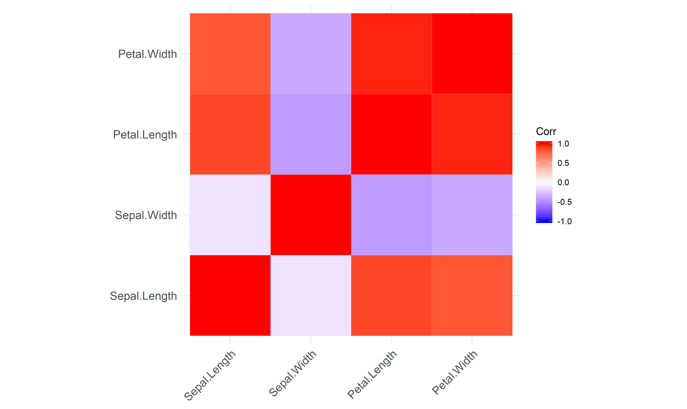

# correlation 

[](https://doi.org/10.21105/joss.02306)
[](https://cran.r-project.org/package=correlation)
[](https://cranlogs.r-pkg.org/)

`correlation` is an
[**easystats**](https://github.com/easystats/easystats) package focused
on correlation analysis. It’s lightweight, easy to use, and allows for
the computation of many different kinds of correlations, such as
**partial** correlations, **Bayesian** correlations, **multilevel**
correlations, **polychoric** correlations, **biweight**, **percentage
bend** or **Sheperd’s Pi** correlations (types of robust correlation),
**distance** correlation (a type of non-linear correlation) and more,
also allowing for combinations between them (for instance, *Bayesian
partial multilevel correlation*).

You can reference the package and its documentation as follows:

-   Makowski, D., Ben-Shachar, M. S., Patil, I., & Lüdecke, D. (2019).
    *Methods and Algorithms for Correlation Analysis in R*. Journal of
    Open Source Software, 5(51), 2306.
    [10.21105/joss.02306](https://doi.org/10.21105/joss.02306)

## Installation

[](https://cran.r-project.org/package=correlation)
[](https://travis-ci.org/easystats/correlation)
[](https://codecov.io/gh/easystats/correlation)

Run the following to install the stable release of **correlation** from
CRAN:

``` r
install.packages("correlation")
```

Or this one to install the latest development version:

``` r
install.packages("remotes")
remotes::install_github("easystats/correlation")
```

## Documentation

[](https://easystats.github.io/correlation/)
[](https://easystats.github.io/blog/posts/)
[](https://easystats.github.io/correlation/reference/index.html)

Click on the buttons above to access the package
[**documentation**](https://easystats.github.io/correlation/) and the
[**easystats blog**](https://easystats.github.io/blog/posts/), and
check-out these vignettes:

-   [**Types of
    Correlation**](https://easystats.github.io/correlation/articles/types.html)
-   [**Multilevel
    Correlations**](https://easystats.github.io/correlation/articles/multilevel.html)

## Features

The *correlation* package can compute many different types of
correlation, including:

-   [x] **Pearson’s correlation**
-   [x] **Spearman’s rank correlation**
-   [x] **Kendall’s rank correlation**
-   [x] **Biweight midcorrelation**
-   [x] **Distance correlation**
-   [x] **Percentage bend correlation**
-   [x] **Shepherd’s Pi correlation**
-   [x] **Blomqvist’s coefficient**
-   [x] **Hoeffding’s D**
-   [x] **Gamma correlation**
-   [x] **Gaussian rank correlation**
-   [x] **Point-Biserial and biserial correlation**
-   [x] **Winsorized correlation**
-   [x] **Polychoric correlation**
-   [x] **Tetrachoric correlation**
-   [x] **Multilevel correlation**

An overview and description of these correlations types is [**available
here**](https://easystats.github.io/correlation/articles/types.html).
Moreover, many of these correlation types are available as **partial**
or within a **Bayesian** framework.

# Examples

The main function is
[`correlation()`](https://easystats.github.io/correlation/reference/correlation.html),
which builds on top of
[`cor_test()`](https://easystats.github.io/correlation/reference/cor_test.html)
and comes with a number of possible options.

## Correlation details and matrix

``` r
results <- correlation(iris)
results
## Parameter1   |   Parameter2 |     r |         95% CI | t(148) |      p |  Method | n_Obs
## ----------------------------------------------------------------------------------------
## Sepal.Length |  Sepal.Width | -0.12 | [-0.27,  0.04] |  -1.44 | 0.152  | Pearson |   150
## Sepal.Length | Petal.Length |  0.87 | [ 0.83,  0.91] |  21.65 | < .001 | Pearson |   150
## Sepal.Length |  Petal.Width |  0.82 | [ 0.76,  0.86] |  17.30 | < .001 | Pearson |   150
## Sepal.Width  | Petal.Length | -0.43 | [-0.55, -0.29] |  -5.77 | < .001 | Pearson |   150
## Sepal.Width  |  Petal.Width | -0.37 | [-0.50, -0.22] |  -4.79 | < .001 | Pearson |   150
## Petal.Length |  Petal.Width |  0.96 | [ 0.95,  0.97] |  43.39 | < .001 | Pearson |   150
## 
## p-value adjustment method: Holm (1979)
```

The output is not a square matrix, but a **(tidy) dataframe with all
correlations tests per row**. One can also obtain a **matrix** using:

``` r
summary(results)
## Parameter    | Petal.Width | Petal.Length | Sepal.Width
## -------------------------------------------------------
## Sepal.Length |     0.82*** |      0.87*** |       -0.12
## Sepal.Width  |    -0.37*** |     -0.43*** |            
## Petal.Length |     0.96*** |              |
```

Note that one can also obtain the full, **square** and redundant matrix
using:

``` r
summary(results, redundant=TRUE)
## Parameter    | Sepal.Length | Sepal.Width | Petal.Length | Petal.Width
## ----------------------------------------------------------------------
## Sepal.Length |      1.00*** |       -0.12 |      0.87*** |     0.82***
## Sepal.Width  |        -0.12 |     1.00*** |     -0.43*** |    -0.37***
## Petal.Length |      0.87*** |    -0.43*** |      1.00*** |     0.96***
## Petal.Width  |      0.82*** |    -0.37*** |      0.96*** |     1.00***
```

``` r
library(dplyr)
library(see)

results %>% 
  summary(redundant=TRUE) %>% 
  plot()
```

<!-- -->

## Grouped dataframes

The function also supports **stratified correlations**, all within the
*tidyverse* workflow!

``` r
iris %>% 
  select(Species, Sepal.Length, Sepal.Width, Petal.Width) %>% 
  group_by(Species) %>% 
  correlation()
## Group      |   Parameter1 |  Parameter2 |    r |        95% CI | t(48) |      p |  Method | n_Obs
## -------------------------------------------------------------------------------------------------
## setosa     | Sepal.Length | Sepal.Width | 0.74 | [ 0.59, 0.85] |  7.68 | < .001 | Pearson |    50
## setosa     | Sepal.Length | Petal.Width | 0.28 | [ 0.00, 0.52] |  2.01 | 0.101  | Pearson |    50
## setosa     |  Sepal.Width | Petal.Width | 0.23 | [-0.05, 0.48] |  1.66 | 0.104  | Pearson |    50
## versicolor | Sepal.Length | Sepal.Width | 0.53 | [ 0.29, 0.70] |  4.28 | < .001 | Pearson |    50
## versicolor | Sepal.Length | Petal.Width | 0.55 | [ 0.32, 0.72] |  4.52 | < .001 | Pearson |    50
## versicolor |  Sepal.Width | Petal.Width | 0.66 | [ 0.47, 0.80] |  6.15 | < .001 | Pearson |    50
## virginica  | Sepal.Length | Sepal.Width | 0.46 | [ 0.20, 0.65] |  3.56 | 0.002  | Pearson |    50
## virginica  | Sepal.Length | Petal.Width | 0.28 | [ 0.00, 0.52] |  2.03 | 0.048  | Pearson |    50
## virginica  |  Sepal.Width | Petal.Width | 0.54 | [ 0.31, 0.71] |  4.42 | < .001 | Pearson |    50
## 
## p-value adjustment method: Holm (1979)
```

## Bayesian Correlations

It is very easy to switch to a **Bayesian framework**.

``` r
correlation(iris, bayesian = TRUE)
## Parameter1   |   Parameter2 |   rho |         95% CI |     pd | % in ROPE |     BF |              Prior |           Method | n_Obs
## ----------------------------------------------------------------------------------------------------------------------------------
## Sepal.Length |  Sepal.Width | -0.11 | [-0.24,  0.01] | 91.95% |    42.80% |  0.509 | Cauchy (0 +- 0.33) | Bayesian Pearson |   150
## Sepal.Length | Petal.Length |  0.86 | [ 0.83,  0.89] |   100% |        0% | > 1000 | Cauchy (0 +- 0.33) | Bayesian Pearson |   150
## Sepal.Length |  Petal.Width |  0.81 | [ 0.76,  0.85] |   100% |        0% | > 1000 | Cauchy (0 +- 0.33) | Bayesian Pearson |   150
## Sepal.Width  | Petal.Length | -0.41 | [-0.51, -0.30] |   100% |        0% | > 1000 | Cauchy (0 +- 0.33) | Bayesian Pearson |   150
## Sepal.Width  |  Petal.Width | -0.35 | [-0.46, -0.24] |   100% |        0% | > 1000 | Cauchy (0 +- 0.33) | Bayesian Pearson |   150
## Petal.Length |  Petal.Width |  0.96 | [ 0.95,  0.97] |   100% |        0% | > 1000 | Cauchy (0 +- 0.33) | Bayesian Pearson |   150
```

## Tetrachoric, Polychoric, Biserial, Biweight…

The `correlation` package also supports different types of methods,
which can deal with correlations **between factors**!

``` r
correlation(iris, include_factors = TRUE, method = "auto")
## Parameter1         |         Parameter2 |     r |         95% CI | t(148) |      p |         Method | n_Obs
## -----------------------------------------------------------------------------------------------------------
## Sepal.Length       |        Sepal.Width | -0.12 | [-0.27,  0.04] |  -1.44 | 0.452  |        Pearson |   150
## Sepal.Length       |       Petal.Length |  0.87 | [ 0.83,  0.91] |  21.65 | < .001 |        Pearson |   150
## Sepal.Length       |        Petal.Width |  0.82 | [ 0.76,  0.86] |  17.30 | < .001 |        Pearson |   150
## Sepal.Length       |     Species.setosa | -0.72 | [-0.79, -0.63] | -12.53 | < .001 | Point-biserial |   150
## Sepal.Length       | Species.versicolor |  0.08 | [-0.08,  0.24] |   0.97 | 0.452  | Point-biserial |   150
## Sepal.Length       |  Species.virginica |  0.64 | [ 0.53,  0.72] |  10.08 | < .001 | Point-biserial |   150
## Sepal.Width        |       Petal.Length | -0.43 | [-0.55, -0.29] |  -5.77 | < .001 |        Pearson |   150
## Sepal.Width        |        Petal.Width | -0.37 | [-0.50, -0.22] |  -4.79 | < .001 |        Pearson |   150
## Sepal.Width        |     Species.setosa |  0.60 | [ 0.49,  0.70] |   9.20 | < .001 | Point-biserial |   150
## Sepal.Width        | Species.versicolor | -0.47 | [-0.58, -0.33] |  -6.44 | < .001 | Point-biserial |   150
## Sepal.Width        |  Species.virginica | -0.14 | [-0.29,  0.03] |  -1.67 | 0.392  | Point-biserial |   150
## Petal.Length       |        Petal.Width |  0.96 | [ 0.95,  0.97] |  43.39 | < .001 |        Pearson |   150
## Petal.Length       |     Species.setosa | -0.92 | [-0.94, -0.89] | -29.13 | < .001 | Point-biserial |   150
## Petal.Length       | Species.versicolor |  0.20 | [ 0.04,  0.35] |   2.51 | 0.066  | Point-biserial |   150
## Petal.Length       |  Species.virginica |  0.72 | [ 0.63,  0.79] |  12.66 | < .001 | Point-biserial |   150
## Petal.Width        |     Species.setosa | -0.89 | [-0.92, -0.85] | -23.41 | < .001 | Point-biserial |   150
## Petal.Width        | Species.versicolor |  0.12 | [-0.04,  0.27] |   1.44 | 0.452  | Point-biserial |   150
## Petal.Width        |  Species.virginica |  0.77 | [ 0.69,  0.83] |  14.66 | < .001 | Point-biserial |   150
## Species.setosa     | Species.versicolor | -0.88 | [-0.91, -0.84] | -22.43 | < .001 |    Tetrachoric |   150
## Species.setosa     |  Species.virginica | -0.88 | [-0.91, -0.84] | -22.43 | < .001 |    Tetrachoric |   150
## Species.versicolor |  Species.virginica | -0.88 | [-0.91, -0.84] | -22.43 | < .001 |    Tetrachoric |   150
## 
## p-value adjustment method: Holm (1979)
```

## Partial Correlations

It also supports **partial correlations** (as well as Bayesian partial
correlations).

``` r
iris %>% 
  correlation(partial = TRUE) %>% 
  summary()
## Parameter    | Petal.Width | Petal.Length | Sepal.Width
## -------------------------------------------------------
## Sepal.Length |    -0.34*** |      0.72*** |     0.63***
## Sepal.Width  |     0.35*** |     -0.62*** |            
## Petal.Length |     0.87*** |              |
```

## Gaussian Graphical Models (GGMs)

Such partial correlations can also be represented as **Gaussian
Graphical Models** (GGM), an increasingly popular tool in psychology. A
GGM traditionally include a set of variables depicted as circles
(“nodes”), and a set of lines that visualize relationships between them,
which thickness represents the strength of association (see [Bhushan et
al.,
2019](https://www.frontiersin.org/articles/10.3389/fpsyg.2019.01050/full)).

``` r
library(see) # for plotting
library(ggraph) # needs to be loaded

mtcars %>% 
  correlation(partial = TRUE) %>% 
  plot()
```

<!-- -->

## Multilevel Correlations

It also provide some cutting-edge methods, such as Multilevel (partial)
correlations. These are are partial correlations based on **linear mixed
models** that include the factors as random effects. They can be see as
correlations *adjusted* for some group (*hierarchical*) variability.

``` r
iris %>% 
  correlation(partial = TRUE, multilevel = TRUE) %>% 
  summary()
## Parameter    | Petal.Width | Petal.Length | Sepal.Width
## -------------------------------------------------------
## Sepal.Length |      -0.17* |      0.71*** |     0.43***
## Sepal.Width  |     0.39*** |       -0.18* |            
## Petal.Length |     0.38*** |              |
```

However, if the `partial` argument is set to `FALSE`, it will try to
convert the partial coefficient into regular ones.These can be
**converted back** to full correlations:

``` r
iris %>% 
  correlation(partial = FALSE, multilevel = TRUE) %>% 
  summary()
## Parameter    | Petal.Width | Petal.Length | Sepal.Width
## -------------------------------------------------------
## Sepal.Length |     0.36*** |      0.76*** |     0.53***
## Sepal.Width  |     0.47*** |      0.38*** |            
## Petal.Length |     0.48*** |              |
```
